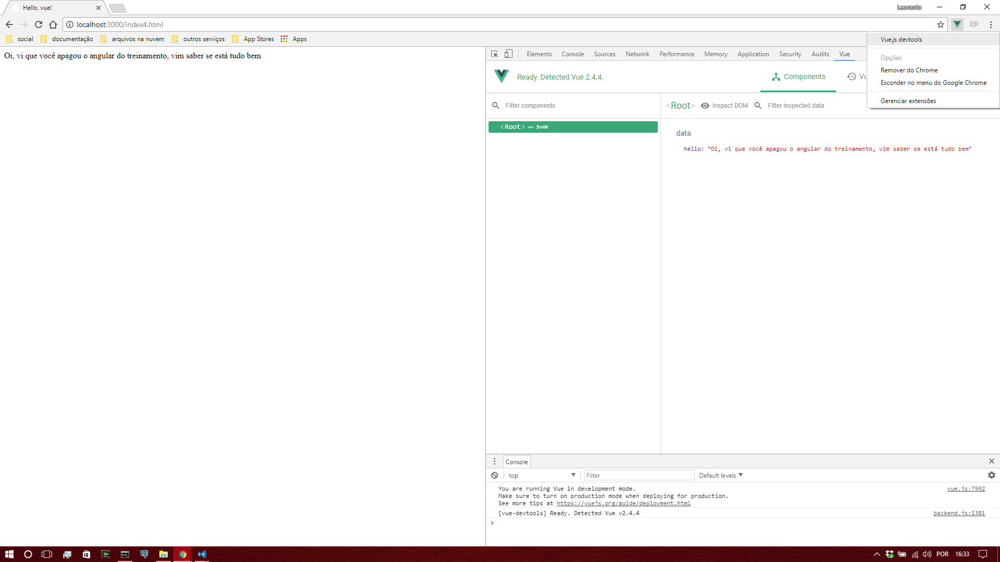

# HelloJS 3.0.0 chapter 4 ("eita!" version)

- respondam a issue de presença!
- não esqueçam de criar logo o projeto hellojs-s03e05, vai ser preciso para o desafio.
- e façam checkout né?!

## Agenda

- CSS
- vue (hello!)
- Axios
- ~~browserify (boooomm!)~~ próxima aula, pois muda um pouco a montagem do projeto

## CSS

- Cascading Style Sheet
- documentos html não precisam ser preto e branco
- vamos montar um projeto npm com express e configurar para servir arquivos estáticos

```bash
mkdir hellojs-s03e05
cd hellojs-s03e05
npm init -y
npm install express body-parser knex sqlite3 --save
npm install nodemon --save-dev
mkdir public
# no windows não tem echo, use echo '' > index.js
touch index.js
touch db.js
touch public/index.html
# echo public\index.html
```

- **mini-hallenge!** 
  - façam um index.js mínimo pra servir arquivos estáticos (spoilers logo abaixo)
  


```javascript
// index.js
const express = require("express")
const app = express()

app.use(express.static("public"))

app.listen(3000)

console.log("ctrl+c to quit")
```

- ** bonus **
  - com o nodemon, toda vez que você allterar o script, o processo será recarregado *automagicamente*
  - adicionalmente, vamos criar nosso primeiro npm script

```json
{
  "name": "hellojs-s03e05",
  "version": "1.0.0",
  "description": "",
  "main": "index.js",
  "scripts": {
    "dev": "nodemon index.js"
  },
  "keywords": [],
  "author": "",
  "license": "ISC",
  "dependencies": {
    "body-parser": "^1.18.1",
    "express": "^4.15.4",
    "knex": "^0.13.0",
    "sqlite3": "^3.1.11"
  },
  "devDependencies": {
    "browserify": "^14.4.0",
    "nodemon": "^1.12.1"
  }
}
```

- daqui por diante, em vez de **node index.js** (várias e várias vezes), vamos chamar **npm run dev**

```bash
[nodemon] 1.12.1
[nodemon] to restart at any time, enter `rs`
[nodemon] watching: *.*
[nodemon] starting `node index.js`
ctrl+c to quit
```

- de volta ao CSS. Com CSS podemos: 
  - criar classes, identificadores ou elementos
  - manipular 
    - a cor das coisas
    - a forma
    - posição
- e muito mais

```html
<!DOCTYPE html>
<!-- index.html -->
<html>
<head>
  <meta charset="utf-8">
  <title>Hello, css!</title>
  <style>
    .quente{
      background-color:blue;
    }
    #mania {
      width:240px;
      height:70px;
      border-radius:10px;
      border: 1px groove black;
    }
    ul{
      position:absolute;
      left:20%;
      bottom:300px;
    }
  </style>
</head>
<body>
  <h1>CSS</h1>
  <p class="quente">Podemos mexer na cor</p>
  <div id="mania">Podemos mexer na forma</div>
  <ul>
    <li>Podemos</li>
    <li>Mexer</li>
    <li>Na</li>
    <li>Posição</li>
  </ul>
</body>
</html>
```

- entendendo como funcionam o s seletores (id's, classes, elementos, pseudo-*things*) o resto é definir as regras
- largamente documentado [aqui](https://developer.mozilla.org/pt-BR/docs/Web/CSS)
- vários kits (frameworks) pra bonitificar sua página sem muito esforço

```html
<!-- index2.html -->
<html>

<head>
  <meta charset="utf-8">
  <title>Hello, css!</title>
  <!-- podemos consumir js e css diretamente da internet, sem ter nada no servidor local. -->
  <link rel="StyleSheet" href="https://maxcdn.bootstrapcdn.com/bootstrap/3.3.7/css/bootstrap.min.css" />
  <script type="text/javascript" src="https://code.jquery.com/jquery-3.2.1.min.js"></script>
  <script type="text/javascript" src="https://maxcdn.bootstrapcdn.com/bootstrap/3.3.7/js/bootstrap.min.js"></script>
</head>

<body>
  <div class="container">
    <h1>CSS, CDN, etcetera et al</h1>
    <div class="well">
      <p>Coisas que o css pode fazer</p>
      <div class="panel panel-info">
        <div class="panel-heading">
          <h3 class="panel-title">Panel title</h3>
        </div>
        <div class="panel-body">
          painéis bonitos
        </div>
      </div>
      <div class="btn-group" role="group" aria-label="...">
        <button type="button" class="btn btn-default">Uns</button>
        <button type="button" class="btn btn-default">Botões</button>
        <button type="button" class="btn btn-default">Bacanudos</button>
      </div>
      <br/>
      <br/>
      
      <ul class="list-group">
        <li class="list-group-item">
          <span class="badge">14</span> <a target="_blank" href="https://getbootstrap.com/docs/3.3/components/#list-group">E muito mais</a>
        </li>
      </ul>
    </div>
  </div>
</body>

</html>
```

- Os CDN's (Content Distribution Network) ajudam na rápida prototipação das coisas
- tem vários deles
- olha mais um:

```html
<!DOCTYPE html>
<!-- index3.html -->
<html>

<head>
  <meta charset="utf-8">
  <title>Hello, css!</title>
  <link rel="stylesheet" href="https://fonts.googleapis.com/icon?family=Material+Icons">
  <link rel="stylesheet" href="https://code.getmdl.io/1.3.0/material.indigo-pink.min.css">
  <script defer src="https://code.getmdl.io/1.3.0/material.min.js"></script>
</head>

<body>
  <div style="position:absolute;left:10%;top:10%;right:10%;">
    <!-- Accent-colored raised button with ripple -->
    <button class="mdl-button mdl-js-button mdl-button--raised mdl-js-ripple-effect mdl-button--accent">
      Sou um botão
    </button>
    <br/>
    <br/>

    <div class="demo-card-square mdl-card mdl-shadow--2dp">
      <div class="mdl-card__title mdl-card--expand">
        <h2 class="mdl-card__title-text">Sou um cartão</h2>
      </div>
      <div class="mdl-card__supporting-text">
        Lorem ipsum dolor sit amet, consectetur adipiscing elit. Aenan convallis.
      </div>
      <div class="mdl-card__actions mdl-card--border">
        <a class="mdl-button mdl-button--colored mdl-js-button mdl-js-ripple-effect">
            Uma ação de cartão
          </a>
      </div>
    </div>
    <br/>
    <br/>

    <a target="_blank" href="https://getmdl.io/components/index.html#buttons-section">Você entendeu.</a>
  </div>

</body>

</html>
```

- tem framework inteiramente dedicado a  layout
  - [http://flexboxgrid.com/](http://flexboxgrid.com/)

## vue.js

- ~~melhor que react~~ uma alternativa de qualidade, independente e de fácil aprendizado ao angular 1
- tocado pelo evan you *e voluntários*
- patreon opencollective, etc etc
- model-view-view-model
- mágica
- escalável (para cima e para baixo)

```html
<!DOCTYPE html>
<!-- index4.html -->
<html>

<head>
  <meta charset="utf-8">
  <title>Hello, vue!</title>
  <script src="https://unpkg.com/vue"></script>
</head>

<body>
  <div id="app">
    {{hello}}
  </div>
  <script>
    new Vue({
      el: document.getElementById("app"),
      data: {
        hello: "Oi, vi que você apagou o angular do treinamento, vim saber se está tudo bem"
      }
    })
  </script>
</body>

</html>
```

- quanto mais você usa, mais magia negra parece
- ferramentas para explorar a **virtual DOM**



```html
<!DOCTYPE html>
<!-- index5.html -->
<html>

<head>
  <meta charset="utf-8">
  <title>Hello, vue!</title>
  <script src="https://unpkg.com/vue"></script>
</head>

<body>
  <div id="app">
    <form @submit.prevent="dosave">
      <fieldset>
        <legend>Detalhe contato <span v-if="detalhe.idcontato"> #{{detalhe.idcontato}}</span></legend>
        <label>Nome <input v-model="detalhe.nomecontato"/></label><br/>
        <label>Endereço <input v-model="detalhe.enderecocontato"/></label><br/>
        <label>Telefone <input v-model="detalhe.telefonecontato"/></label><br/>
        <input type="submit" value="salvar" />
      </fieldset>
    </form>
    <table>
      <thead>
        <tr>
          <th>ID</th>
          <th>Nome</th>
          <th>endereço</th>
          <th>Telefone</th>
          <th></th>
        </tr>
      </thead>
      <tbody>
        <tr v-for="contato in lista">
          <td>{{contato.idcontato}}</td>
          <td>{{contato.nomecontato}}</td>
          <td>{{contato.enderecocontato}}</td>
          <td>{{contato.telefonecontato}}</td>
          <td>
            <button @click="editar(contato)">Editar</button>
          </td>
        </tr>
      </tbody>
    </table>
  </div>
  <script>
    const novocontato = _ => ({
      nomecontato: "",
      enderecocontato: "",
      telefonecontato: "",
    })
    new Vue({
      el: document.getElementById("app"),
      data: {
        detalhe: novocontato(),
        lista: []
      },
      methods: {
        dosave() {
          if (!this.detalhe.idcontato) {
            this.detalhe.idcontato = new Date().getTime()
            this.lista.push(this.detalhe)
          }
          this.detalhe = novocontato()
        },
        editar(contato) {
          this.detalhe = contato;
        }
      }
    })
  </script>
</body>

</html>
```

- *e cadê os fire-change-\* events?* 
- o view-model do vue instalou observers por você
- that's it

## axios

- mas nós já vimos axios
- que bom, :-)
- nosso formulário pode conversar com o servidor.
- **configure acesso ao banco**
- **crie migrate pra termos uma tabela de contatos**
- **no express, uma rota pra listar, uma pra inserir e uma pra atualizar**

```bash
knex init .
knex migrate:make esquema_inicial
```

- o migrate vai ser mais ou menos assim:

```javascript
// migrations/20170920171141_esquema_inicial.js
exports.up = knex => knex.schema.createTable("contato", tb => {
  tb.increments("idcontato")
  tb.string("nomecontato")
  tb.string("enderecocontato")
  tb.string("telefonecontato")
})

exports.down = knex => knex.schema.dropTable("contato")
```

- o db.js é a gosto do freguês

```javascript
// db.js
exports.knex = require("knex")(require("./knexfile").development)
``` 

- as rotas no express

```javascript
// index.js
const knex = require("./db").knex
const express = require("express")
const bodyParser = require("body-parser")
const app = express()

app.use(bodyParser.json())
app.use(express.static("public"))

app.get("/list", (req, res) => 
  knex("contato").select().then(ret => res.send(ret)))
app.post("/save", (req, res) => 
  knex("contato").insert(req.body, "idcontato").then(ret => res.send("OK-" + ret)))
app.put("/save", (req, res) => 
  knex("contato").update(req.body)
  .where("idcontato", req.body.idcontato).then(ret => res.send("OK-" + ret)))

knex.migrate.latest().then(_ => app.listen(3000))

console.log("ctrl+c to quit")
``` 

- da outra vez usamos o axios a partir do node, do lado do servidor
- acontece que o axios é o axios tanto no frontend quanto no backend
- vamos para mais um documento html, baseado no anterior

```html
<!DOCTYPE html>
<!-- index6.html -->
<html>

<head>
  <meta charset="utf-8">
  <title>Hello, vue + axios!</title>
  <script src="https://unpkg.com/vue"></script>
  <script src="https://cdnjs.cloudflare.com/ajax/libs/axios/0.16.2/axios.min.js"></script>
</head>

<body>
  <div id="app">
    <form @submit.prevent="dosave">
      <fieldset>
        <legend>Detalhe contato <span v-if="detalhe.idcontato"> #{{detalhe.idcontato}}</span></legend>
        <label>Nome <input v-model="detalhe.nomecontato"/></label><br/>
        <label>Endereço <input v-model="detalhe.enderecocontato"/></label><br/>
        <label>Telefone <input v-model="detalhe.telefonecontato"/></label><br/>
        <input type="submit" value="salvar" />
      </fieldset>
    </form>
    <table>
      <thead>
        <tr>
          <th>ID</th>
          <th>Nome</th>
          <th>endereço</th>
          <th>Telefone</th>
          <th></th>
        </tr>
      </thead>
      <tbody>
        <tr v-for="contato in lista">
          <td>{{contato.idcontato}}</td>
          <td>{{contato.nomecontato}}</td>
          <td>{{contato.enderecocontato}}</td>
          <td>{{contato.telefonecontato}}</td>
          <td>
            <button @click="editar(contato)">Editar</button>
          </td>
        </tr>
      </tbody>
    </table>
  </div>
  <script>
    const novocontato = _ => ({
      nomecontato: "",
      enderecocontato: "",
      telefonecontato: "",
    })
    
    const api = axios.create({
      // se você abrir o index6.html em 127.0.0.1, tem que mudar aqui de localhost para 127.0.0.1 aqui
      baseURL:"http://localhost:3000"
    })
    
    new Vue({
      el: document.getElementById("app"),
      data: {
        detalhe: novocontato(),
        lista: []
      },
      created(){
        console.log("viewmodel online")
        this.listcontatos()
      },
      methods: {
        dosave() {
          api[this.detalhe.idcontato?"put":"post"]("/save",this.detalhe).then(ret => {
            console.log(ret.data)
            this.detalhe = novocontato()
            this.listcontatos()
          })
        },
        editar(contato) {
          this.detalhe = contato;
        },
        listcontatos(){
          api.get("/list").then(ret => this.lista = ret.data)
        }
      }
    })
  </script>
</body>

</html>
```

## :fire::fire::fire: Desafio para até a próxima aula :fire::fire::fire:

- baseado no que você viu de css e no que você viu de vue e axios
- escolha um framework css apresentado (ou procure outro) e deixe a telinha do index6.html mais bonita
- implemente uma rota de deleção no express/knex
- adicione o botão de deletar na tabela, que nem o de editar
- o nome do repositório já foi apresentado lá em cima
- postar o link do repositório-solução na issue de chamada do episódio 5
