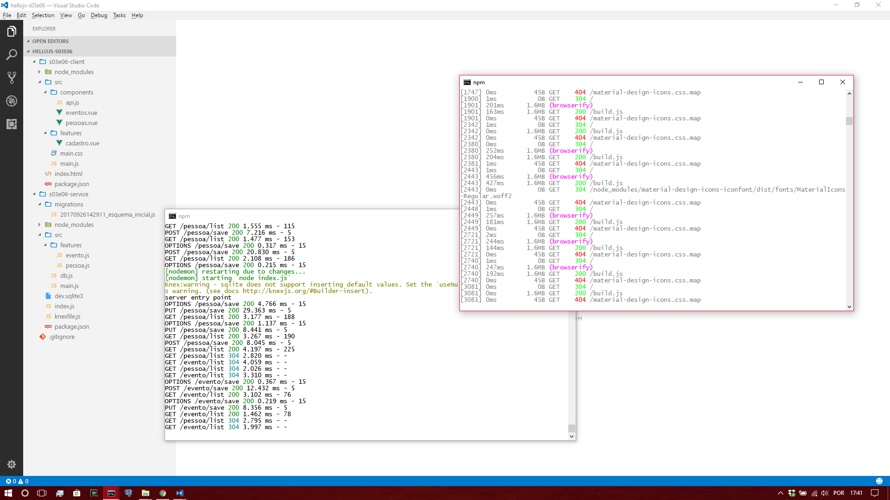

# HelloJS 3.0.0 chapter 6 

- respondam a chamada
- criem seus projetos
- warp drive engage!!

## Agenda

- browserify
- budo
- vue-material
- google material icons
- componentes e render funcions

## browserify

- levar o require do node para o browser
- acesso aos pacotes do npm
- bundler
- mas antes vamos montar os projetos!

```bash
# em vez de mkdir você pode fazer o git clone do projeto criado no github
mkdir hellojs-s03e06
cd hellojs-s03e06
mkdir s03e06-client
mkdir s03e06-service
cd s03e06-client
npm init -y
cd ..
cd s03e06-service
npm init -y
cd .. 
echo node_modules > .gitignore
```

- teremos 2 projetos por repositório a partir de agora
- a pasta static é bom, mas temos duas bases de código
- cliente/serviço no mesmo projeto é confuso
  - já foi tentado no passado (tomcat/eclipse? hello?)
- um projeto é 100% front
- outro projeto é 100% back
- organizado
- pouco acoplado
- feliz :-)

```bash
# muita atenção agora!
# cada projeto tem dependências diferentes!
cd s03e06-service
npm install knex express body-parser morgan sqlite3 --save
npm install nodemon --save-dev
cd ..
```

- o projeto **s03e06-service** terá tudo o que precisarmos para rodar o servidor node
- o projeto **s03e06-client** terá tudo o que precisarmos para fazer um cliente web para o serviço
  - você pode ter mais de um projeto cliente (ex: s03e06-admin, s03e06-usuario, por aí vai)

```bash
cd s03e06-client
npm install vue vue-material material-design-icons-iconfont axios --save
npm install browserify vueify browserify-css budo --save-dev
cd ..
```
- enter browserify
- vamos usar o vue vindo do registro do npm em vez de usar a partir de um CDN
- livres da dependência de um servidor de terceiros
- gerenciar os dois projetos ao mesmo tempo pode parecer complicado
  - mas na verdade é bem mais simples, só vai precisar de 2 consoles ao mesmo tempo

```bash
hellojs-s03e06
├─ s03e06-client
│  ├─ node_modules
│  └─ package.json
│
├─ s03e06-service
│  ├─ node_modules
│  └─ package.json
│
└─ .gitignore
```

### Projeto service

- **importante** a gestão de configuração começa a ficar importante
- garanta que você só tem **dois** pacakge.json, e não *três**
  - o npm pode achar que o package.json de qualquer pasta superior é o que vale
    - bugs pouco elegantes aparecerão
- estruture o projeto service (abra desde já o novo console para a pasta de projeto)

```bash
cd s03e06-service
mkdir src
touch index.js
cd src
touch main.js
touch db.js
mkdir features
cd features
touch pessoa.js
touch evento.js
cd ..
cd ..
# lembrar do "./node_modules/.bin/knex" caso não tenha knex instalado a nível de sistema
knex init .
knex migrate:make esquema_inicial
```

- edite seu package.json para 
  - criar o script **"dev"**

```json
{
  "name": "s03e06-service",
  "version": "1.0.0",
  "description": "",
  "main": "index.js",
  "scripts": {
    "dev": "nodemon index.js"
  },
  "keywords": [],
  "author": "",
  "license": "ISC",
  "dependencies": {
    "body-parser": "^1.18.2",
    "express": "^4.15.5",
    "knex": "^0.13.0",
    "morgan": "^1.8.2",
    "sqlite3": "^3.1.12"
  },
  "devDependencies": {
    "nodemon": "^1.12.1"
  }
}
```

- index.js

```javascript
// index.js
const main = require("./src/main")
console.log("server entry point")
main.start(3000)
```

- src/main.js
- note como a divisão do aplicativo em pedaços torna a leitura mais fácil

```javascript
// src/main.js
const knex = require("./db").knex
const express = require("express")
const bodyParser = require("body-parser")
const morgan = require("morgan")
const app = express()

app.use(morgan("dev"))
app.use(bodyParser.json())

app.use("/pessoa", require("./features/pessoa").router)
app.use("/evento", require("./features/evento").router)

// uma conveniência pra saber se o servidor está em pé
app.get("/online", (req, res) => res.send("ONLINE"))

exports.start = porta => 
  knex.migrate.latest().then( _ => app.listen(porta))
```
- o [morgan](https://github.com/expressjs/morgan/) serve pra você ver as requisições chegando. é útil
- src/db.js

```javascript
// src/db.js
const cfg = require("../knexfile")
const knex = require("knex")(cfg.development)
exports.knex = knex
```

- o knexfile não pode ficar dentro de *src*
  - o knex usa ele, via linha de comando, a partir da pasta raíz do projeto
- no migrate vamos criar três tabelas
  - duas de entidade
  - uma de relacionamento
- migrations/20170926142911_esquema_inicial.js

```javascript
// migrations/20170926142911_esquema_inicial.js
exports.up = knex => knex.schema.createTable("pessoa", tb => {
  tb.increments("idpessoa")
  tb.string("nomepessoa")
}).createTable("evento", tb => {
  tb.increments("idevento")
  tb.string("tituloevento")
  tb.timestamp("dataevento").notNullable().defaultTo(knex.fn.now())
}).createTable("pessoa_evento", tb => {
  tb.integer("idpessoa")
  tb.integer("idevento")
  tb.primary(["idpessoa", "idevento"])
})

exports.down = knex => knex.schema
  .dropTable("pessoa_evento")
  .dropTable("evento")
  .dropTable("pessoa")
```

- uma vantagem do express é que podemos separar as coisas em sub-rotas 
  - basta usar o **express.Router**
- o nome features é meramente ilustrativo
  - mas é bom pensar em uma separação entre funcionalidades e componentes reusáveis
- src/features/pessoa.js

```javascript
// src/features/pessoa.js
const knex = require("../db").knex
const router = require("express").Router()

router.get("/list", (req,res) => 
  knex("pessoa").select().then(ret => res.send(ret)))
router.post("/save", (req,res) => 
  knex("pessoa").insert(req.body,"idpessoa").then(ret => res.send("OK: "+ret)))
router.put("/save", (req,res) => 
  knex("pessoa").update(req.body).where("idpessoa",req.body.idpessoa).then(ret => res.send("OK: "+ret)))
router["delete"]("/:idpessoa", (req,res) => 
  knex("pessoa").del().where("idpessoa",req.params.idpessoa).then(ret => res.send("OK: "+ret)))

exports.router = router
```

- src/features/evento.js
- note as rotas que mexem com a tabela de relacionamentos

```javascript
// src/features/evento.js
const knex = require("../db").knex
const router = require("express").Router()

router.get("/list", (req,res) => 
  knex("evento").select().then(ret => res.send(ret)))
router.post("/save", (req,res) => 
  knex("evento").insert(req.body,"idevento").then(ret => res.send("OK: "+ret)))
router.put("/save", (req,res) => 
  knex("evento").update(req.body).where("idevento",req.body.idevento).then(ret => res.send("OK: "+ret)))
router["delete"]("/:idevento", (req,res) => 
  knex("evento").del().where("idevento",req.params.idevento).then(ret => res.send("OK: "+ret)))

router.get("/participar/:idpessoa/:idevento", (req,res) => 
  knex("pessoa_evento").insert(req.params).then(ret => res.send("OK")))

router.delete("/sair/:idpessoa/:idevento", (req,res) => 
  knex("pessoa_evento").del().where(req.params).then(ret => res.send("OK")))

exports.router = router
```
- o serviço está *quase* pronto para ser colocado em operação com um **npm run dev**
- visite o browser em http://127.0.0.1:3000/online

```bash
C:\Users\sombriks\Documents\hellojs-s03e06\s03e06-service>npm run dev

> s03e06-service@1.0.0 dev C:\Users\sombriks\Documents\hellojs-s03e06\s03e06-service
> nodemon index.js

[nodemon] 1.12.1
[nodemon] to restart at any time, enter `rs`
[nodemon] watching: *.*
[nodemon] starting `node index.js`
Knex:warning - sqlite does not support inserting default values. Set the `useNullAsDefault` flag to hide this warning. (see docs http://knexjs.org/#Builder-insert).
server entry point
GET /online 200 8.113 ms - 6
```

- a divisão em sub-rotas permite crescer o projeto de um modo um pouco mais ordeiro
- o serviço está quase pronto para receber clientes.

### Projeto client 

- esse é novo mas é igual
- vamos preparar ele pra rodar com **npm run dev**

```bash
cd s03e06-client
touch index.html
mkdir src
cd src
touch main.js
touch main.css
mkdir features
cd features
touch cadastro.vue
cd ..
mkdir components
cd components
touch pessoas.vue
touch eventos.vue
touch api.js
cd ..
cd ..
```

- prepare o **package.json**

```json
{
  "name": "s03e06-client",
  "version": "1.0.0",
  "description": "",
  "main": "index.js",
  "scripts": {
    "dev": "budo src/main.js:build.js -o -l"
  },
  "keywords": [],
  "author": "",
  "license": "ISC",
  "dependencies": {
    "axios": "^0.16.2",
    "material-design-icons-iconfont": "^3.0.3",
    "vue": "^2.4.4",
    "vue-material": "^0.7.5"
  },
  "devDependencies": {
    "browserify": "^14.4.0",
    "browserify-css": "^0.12.0",
    "budo": "^10.0.4",
    "vueify": "^9.4.1"
  },
  "browserify":{
    "transform":[
      "vueify",
      "browserify-css"
    ]
  }
}
```

- em vez de *nodemon*, temos o **budo** lá no npm script
- tem esse trecho novo no *package.json* todo dedicado ao **browserify**
- o manual completo do browserify você encontra [aqui](https://github.com/browserify/browserify-handbook)
  - mas por hora acredite que essa configuração é
    - pra dar suporte aos arquivos especiais do vue
    - aos arquivos css

- nosso index.html é top-level agora :-)

```html
<!DOCTYPE html>
<html>
<head>
  <title>Hello Browserify!</title>
</head>
<body>
  <div id="app"></div>
  <script src="build.js"></script>
</body>
</html>
```

- é só isso o html
- poderia ser arquivo algum, inclusive, pois o [budo](https://github.com/mattdesl/budo) é capaz de gerar um html automático
  - mas o documento verdadeiro tem utilidade, então vamos seguir criando ele
- **o build.js não existe**, ele é criado pelo budo magicamente a partir do **src/main.js**
- assim como no projeto service, o ponto de execução é a **raíz do projeto**
  - ou seja, **a pasta que tiver o package.json**
- src/main.js

```javascript
// src/main.js
require("./main.css")

const Vue = require("vue")
const VueMaterial = require("vue-material")

// http://vuematerial.io/#/getting-started
Vue.use(VueMaterial) 

Vue.component("cad-pessoas", require("./components/pessoas.vue"))
Vue.component("cad-eventos", require("./components/eventos.vue"))

new Vue({
  el:"#app",
  render: r => r(require("./features/cadastro.vue"))
})
```

- graças ao *browserify-css*, podemos dar import em arquivos css
- graças ao *vueify*, podemos dar import nos arquivos vue
  - estes são os famosos [single file component](https://br.vuejs.org/v2/guide/single-file-components.html) 
- esse *render: r => r(require("./features/cadastro.vue"))* é o nosso entry point
- src/main.css

```css
/* src/main.css */
@import "../node_modules/vue-material/dist/vue-material.css";
@import "../node_modules/material-design-icons-iconfont/dist/material-design-icons.css";
```

- em tempo de desenvolvimento não tem problema importar coisas direto da node_modules
- quando chegar o dia de falarmos de release, nos livramos da node_modules
  - ela é gigante, não vale nem a pena e nem o upload
- src/features/cadastro.vue

```html
<template>
  <md-layout md-gutter>
    <cad-pessoas></cad-pessoas>
    <cad-eventos></cad-eventos>
  </md-layout>
</template>
<script>
module.exports = {
  name: "Cadastro"
}
</script>
```

- arquivos .vue tem essa divisão especial em *template*, *script* e *style*
- aquela tag *cad-pessoas* ali é a mesma que registramos no **main.js**
  - *Vue.component("cad-pessoas", require("./components/pessoas.vue"))*
- src/components/pessoas.vue

```html
<template>
  <md-layout md-gutter md-column>
    <h1>Pessoas</h1>
    <form @submit.prevent="save">
      <md-input-container>
        <label>Nome da pessoa</label>
        <md-input v-model="detalhe.nomepessoa"></md-input>
      </md-input-container>
      <md-button class="md-primary md-raised" type="submit">
        <md-icon>send</md-icon>
        Salvar
      </md-button>
      <md-button class="md-warn md-raised" @click.native="del">
        <md-icon>delete</md-icon>
        Excluir
      </md-button>
    </form>
    <md-table>
      <md-table-header>
        <md-table-row>
          <md-table-head>ID</md-table-head>
          <md-table-head>Nome</md-table-head>
          <md-table-head>Ação</md-table-head>
        </md-table-row>
      </md-table-header>
      <md-table-body>
        <md-table-row v-for="item in lista" :key="item.idpessoa">
          <md-table-cell>{{item.idpessoa}}</md-table-cell>
          <md-table-cell>{{item.nomepessoa}}</md-table-cell>
          <md-table-cell>
            <md-button class="md-icon-button" @click.native="detalhe = item">
              <md-icon>edit</md-icon>
            </md-button>
          </md-table-cell>
        </md-table-row>
      </md-table-body> 
    </md-table>
  </md-layout>
</template>
<script>
const api = require("./api").pessoas
module.exports = {
  name: "CadPessoas",
  created() {
    this.list()
  },
  data() {
    return {
      detalhe: {},
      lista: []
    }
  },
  methods: {
    list() {
      api.list().then(ret => {
        this.lista = ret.data
        this.detalhe = {nomepessoa:""}
      })
    },
    save() {
      api.save(this.detalhe).then(ret => this.list())
    },
    del() {
      api.del(this.detalhe.idpessoa).then(ret => this.list())
    }
  }
}
</script>
```

- exemplificando o uso de alguns componentes do [vue-material](http://vuematerial.io/#/components/table)
- aquele *md-icon* só dá certo porque colocamos o [material-icons](https://material.io/icons/) pra trabalhar
  - **dica** não usar o oficial do google, mas sim esse mostrado lá em cima na hora do npm install
- src/components/eventos.vue

```html
<template>
  <md-layout md-gutter md-column>
    <h1>Eventos</h1>
    <form @submit.prevent="save">
      <md-input-container>
        <label>Título do evento</label>
        <md-input v-model="detalhe.tituloevento"></md-input>
      </md-input-container>
      <md-button class="md-primary md-raised" type="submit">
        <md-icon>send</md-icon>
        Salvar
      </md-button>
      <md-button class="md-warn md-raised" @click.native="del">
        <md-icon>delete</md-icon>
        Excluir
      </md-button>
    </form>
    <md-table>
      <md-table-header>
        <md-table-row>
          <md-table-head>ID</md-table-head>
          <md-table-head>Título</md-table-head>
          <md-table-head>Data</md-table-head>
          <md-table-head>Ação</md-table-head>
        </md-table-row>
      </md-table-header>
      <md-table-body>
        <md-table-row v-for="item in lista" :key="item.idevento">
          <md-table-cell>{{item.idevento}}</md-table-cell>
          <md-table-cell>{{item.tituloevento}}</md-table-cell>
          <md-table-cell>{{item.dataevento}}</md-table-cell>
          <md-table-cell>
            <md-button class="md-icon-button" @click.native="detalhe = item">
              <md-icon>edit</md-icon>
            </md-button>
          </md-table-cell>
        </md-table-row>
      </md-table-body> 
    </md-table>
  </md-layout>
</template>
<script>
const api = require("./api").eventos
module.exports = {
  name: "CadEventos",
  created() {
    this.list()
  },
  data() {
    return {
      detalhe: {},
      lista: []
    }
  },
  methods: {
    list() {
      api.list().then(ret => {
        this.lista = ret.data
        this.detalhe = {tituloevento:""}
      })
    },
    save() {
      api.save(this.detalhe).then(ret => this.list())
    },
    del() {
      api.del(this.detalhe.idevento).then(ret => this.list())
    }
  }
}
</script>
```

- src/components/api.js

```javascript
// src/components/api.js
const axios = require("axios")

const api = axios.create({
  baseURL:"http://localhost:3000"
})

exports.pessoas = {
  list: _ => api.get("/pessoa/list"),
  save: p => api[p.idpessoa?"put":"post"]("/pessoa/save",p),
  del: id => api["delete"](`/pessoa/${id}`)
}

exports.eventos = {
  list: _ => api.get("/evento/list"),
  save: p => api[p.idevento?"put":"post"]("/evento/save",p),
  del: id => api["delete"](`/evento/${id}`)
}
```

- note que é só isso
  - mas todas as requisições no console do navegador devem estar dando um erro assim:

```bash
Failed to load http://localhost:3000/pessoa/list: No 'Access-Control-Allow-Origin' header is present on the requested resource. Origin 'http://192.168.0.102:9966' is therefore not allowed access.
```

- isso é uma feature de segurança dos browsers
  - [Same Origin Policy](https://en.wikipedia.org/wiki/Same-origin_policy)
  - [Cross-origin resource sharing](https://en.wikipedia.org/wiki/Cross-origin_resource_sharing)
- **TL;DR;** a correção é alterar o main.js do projeto de **serviço**
- s03e06-service/src/main.js

```javascript
// src/main.js
const knex = require("./db").knex
const express = require("express")
const bodyParser = require("body-parser")
const morgan = require("morgan")
const app = express()

app.use(morgan("dev"))
app.use(bodyParser.json())

// liberando qualquer origem, uns verbos e alguns headers extras
app.use((req, res, next) => {
  res.header("Access-Control-Allow-Origin", "*")
  res.header("Access-Control-Allow-Methods", "PUT, GET, POST, DELETE, OPTIONS")
  res.header("Access-Control-Allow-Headers", "X-Filename, Content-Type")
  next()
})

app.use("/pessoa", require("./features/pessoa").router)
app.use("/evento", require("./features/evento").router)

app.get("/online", (req, res) => res.send("ONLINE"))

exports.start = porta => 
  knex.migrate.latest().then( _ => app.listen(porta))
```

- agora o service aceita requisições de qualquer lugar
- se for de um site, tá sussa
- se for de um app nativo ios, sussa de novo
- hibrido mobile, sussa again
- o serviço tá de boa agora!



## Desafio (leve)

- criar um segundo projeto client **s03e06-festas**
- criar um novo componente .vue:  **festas.vue**
- o novo **cadastro.vue** deve mostrar somente este componente novo
  - o novo projeto **não precisa do pessoas.vue e nem doceventos.vue**
- o novo componente deve listar pessoas e eventos. 
  - deve ainda, numa terceira lista, mostrar pessoas participando de um evento
  - será preciso uma nova rota pra listar pessoas que participam de um evento
    - estudar o uso do [whereIn](http://knexjs.org/#Builder-whereIn) do knex pra fazer essa consulta
